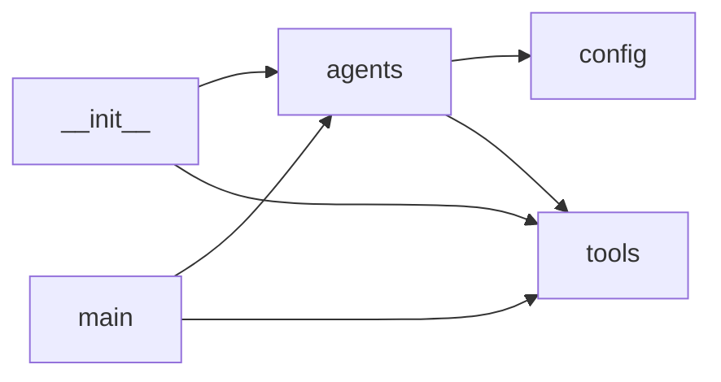

# Codebase Cartographer — Onboarding Map

## What this system does

Codebase Cartographer is an agentic onboarding tool that automatically generates comprehensive documentation for unfamiliar git repositories. Built on HuggingFace's smolagents framework, it uses a hierarchical multi-agent architecture where a manager agent coordinates two specialist agents—one that analyzes code structure and dependencies, another that mines git history for fragility patterns. You point it at any repository and get a structured onboarding map: what the system does, its architecture, dependency diagrams, core modules, risk hotspots, and a recommended reading path.

## Architecture at a glance

The system follows a **manager-specialist pattern** with clear separation across five layers:

**Layer 1: CLI & Entry Point** (`main.py`) — Parses arguments, validates the repository, initializes context, orchestrates the analysis workflow, and writes the final report.

**Layer 2: Agent Orchestration** (`agents.py`) — Defines the three-agent hierarchy:
- **Synthesizer (manager)**: A CodeAgent that delegates tasks and synthesizes findings
- **structure_mapper**: A CodeAgent that writes custom analysis code (AST parsing, import graphs, dependency diagrams)
- **git_historian**: A ToolCallingAgent that mines git history for churn hotspots and bus-factor risks

**Layer 3: Model Abstraction** (`config.py`) — Factory pattern for LLM backend selection (supports HuggingFace Inference, LiteLLM, OpenAI, and Transformers) driven by environment variables.

**Layer 4: Tool Gateway** (`tools.py`) — The security boundary. ALL filesystem reads and git operations flow through guarded functions here. Implements path validation, output capping (prevents context overflow), and command whitelisting. No agent can touch the filesystem directly.

**Layer 5: Public API** (`__init__.py`) — Exports `build_cartographer()`, `ONBOARDING_BRIEF`, and context setters for programmatic use.

**Data flow**: User invokes CLI → main.py sets repo context → builds agent hierarchy → manager delegates to specialists → structure_mapper analyzes code structure, builds import graph, generates Mermaid diagram → git_historian analyzes commit history → manager synthesizes both reports → final Markdown document written to output directory.

## Dependency diagram

**tools.py** is the foundation (3 incoming dependencies) — every other module depends on it. **agents.py** is second (2 dependencies). The graph is acyclic with excellent separation of concerns.

## Core modules

### **tools.py** (497 lines) — THE FOUNDATION
**Why it matters**: This is the only module that touches the filesystem and git. Every piece of data flows through these guarded tools.

**Key responsibilities**:
- Repository context management (`_REPO_ROOT`, `_OUTPUT_DIR` globals)
- Path security (`_safe()` prevents directory traversal attacks)
- Output limiting (`_clip()` caps at 6000 chars to prevent LLM context overflow)
- File operations: `list_files()`, `read_file()`, `file_stats()`
- Code analysis: `detect_entrypoints()`, `build_import_graph()` (uses AST parsing)
- Diagram generation: `export_dependency_diagram()` (generates Mermaid)
- Git history: `run_git()`, `git_churn_hotspots()`, `git_authorship()`

**If this module fails, the entire system is blind.** All I/O, security checks, and data formatting happen here.

### **agents.py** (119 lines) — THE BRAIN
**Why it matters**: Defines the agent hierarchy and task delegation logic.

**Key responsibilities**:
- Constructs the three-agent system with different capabilities
- Contains `ONBOARDING_BRIEF` — the task specification that drives all analysis
- Implements manager-specialist pattern
- Decides which tools each agent gets (structure_mapper gets AST/graph tools, git_historian gets history tools)

**Key design decision**: Uses `CodeAgent` for structure_mapper (needs to write custom analysis code) but `ToolCallingAgent` for git_historian (atomic operations only).

### **main.py** (58 lines) — THE ENTRY POINT
**Why it matters**: The CLI interface and workflow orchestrator.

**Key responsibilities**:
- Argument parsing (`repo` path, `-o` output filename, `-d` output directory, `-q` quiet mode)
- Repository validation (checks for directory and .git folder)
- Context initialization (calls `set_repo_root()`, `set_output_dir()`)
- Agent construction and execution
- Report generation and file writing

**Usage**: `python -m Codebase_Cartographer.main /path/to/repo`

### **config.py** (51 lines) — THE ADAPTER
**Why it matters**: Provides model backend abstraction so you can switch LLMs without code changes.

**Key responsibilities**:
- Reads `MODEL_BACKEND` environment variable
- Factory pattern (`get_model()`) for instantiating different backends
- Supports 4 backends: `inference`, `litellm`, `openai`, `transformers`

## Risk & fragility map

### **Churn Hotspots** (from git history)
The repository is very young (3 commits over 2 days, June 26-27, 2026), so churn analysis has limited predictive value:

1. **README.md** (3 commits) — Documentation refinement only. **Risk: LOW** (not code fragility)
2. **.gitignore** (2 commits) — Configuration changes. **Risk: VERY LOW**
3. **All other files** (1 commit each) — Insufficient churn data to identify fragile modules

**Key insight**: Re-run this analysis after 50-100 commits for meaningful fragility patterns. Current data shows a greenfield project in initial development phase.

### **Bus-Factor Risks** (knowledge concentration)
**CRITICAL RISK**: Bus factor = **1**

- **100% of commits** from a single developer (deepti joshi / deeptij2007)
- **Zero knowledge distribution** across the codebase
- **Highest-risk files** (large + single author):
  - `tools.py` (497 lines, 1 author) — The entire I/O gateway layer
  - `agents.py` (119 lines, 1 author) — Core orchestration logic

**Recommendations**:
1. **Immediate**: Establish backup maintainers
2. Add CONTRIBUTING.md to lower barrier for new contributors
3. Consider pair programming or code reviews to spread knowledge
4. Document architectural decisions (why CodeAgent vs ToolCallingAgent, why global state, etc.)

### **Evolution Patterns**
- **Development pace**: Extremely rapid (981 lines in one commit on day 2)
- **Pattern**: Foundation setup → bulk feature implementation → documentation refinement
- **AI-assisted**: Latest commit co-authored with "Claude Opus 4.8"
- **No test files identified** — Technical debt concern

**Monitoring recommendations**: As development continues, watch for repeated changes to `tools.py` or `agents.py` as indicators of design instability.

## Start here: a reading path

Read these files in order to understand the system:

1. **README.md** (lines 1-40) — Start here for the big picture: what the tool does, how the multi-agent architecture works, and quickstart instructions. Understand the manager-specialist pattern before diving into code.

2. **main.py** (all 58 lines) — The entry point. See how arguments are parsed, how the repository context is initialized with `set_repo_root()` and `set_output_dir()`, and how the agent team is built and executed. This is the workflow orchestrator.

3. **agents.py** (all 119 lines) — The brain. Read `build_cartographer()` to see how the three-agent hierarchy is constructed. Read `ONBOARDING_BRIEF` (lines ~80-110) to understand the task specification. Notice how different agents get different tools and capabilities.

4. **tools.py** (lines 1-100, then jump to key functions) — The foundation. Start with the module docstring and `_safe()` / `_clip()` security functions (lines 30-60). Then read `read_file()` (lines ~140-170) and `build_import_graph()` (lines ~280-350) to understand how code analysis works. This is the largest file but the most critical—all I/O flows through here.

5. **config.py** (all 51 lines) — The adapter. Quick read to understand model backend selection. See how environment variables drive configuration and how the factory pattern works in `get_model()`.

6. **__init__.py** (all 7 lines) — The public API. See what's exported for programmatic use: `build_cartographer()`, `ONBOARDING_BRIEF`, `set_repo_root()`, `set_output_dir()`. If you want to use Cartographer as a library instead of CLI, this shows you how.

**After reading these six files**, you'll understand: (1) what problem this solves, (2) how the multi-agent architecture works, (3) how security is enforced, (4) where to add new tools or agents, and (5) how to run or extend the system.
