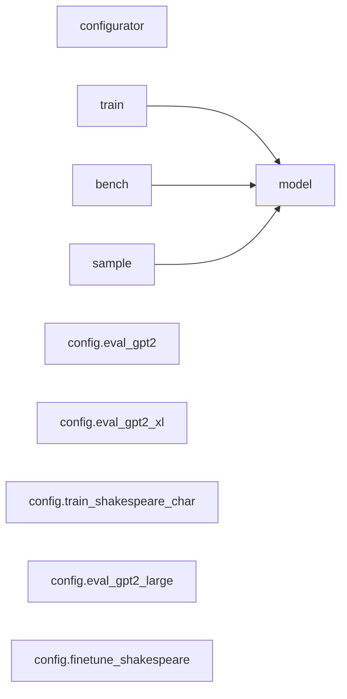

# nanoGPT — Onboarding Map

## What this system does

nanoGPT is a minimalist, educational implementation of GPT-2 for training and finetuning medium-sized language models. It reproduces GPT-2 (124M parameters) on OpenWebText in ~4 days on 8×A100 GPUs with just ~600 lines of core code split between two files: `train.py` (~300 lines) for the training loop and `model.py` (~300 lines) for the GPT architecture. The system prioritizes simplicity, readability, and performance over framework abstractions, making it ideal for learning transformer architectures, rapid prototyping, and research experiments. **Note: As of November 2025, this repository is deprecated in favor of [nanochat](https://github.com/karpathy/nanochat).**

## Architecture at a glance

nanoGPT follows a clean 3-layer architecture:

**Layer 1: Model Definition** (`model.py`)
- Complete GPT-2 transformer implementation in a single file
- Core classes: `GPT`, `Block`, `CausalSelfAttention`, `MLP`, `LayerNorm`
- Supports pre-norm architecture with weight tying between token embeddings and language model head
- Includes Flash Attention for 2-4× speedup on PyTorch ≥2.0

**Layer 2: Training Orchestration** (`train.py`, `sample.py`, `bench.py`)
- `train.py`: DDP-capable training loop with gradient accumulation, mixed precision, and checkpointing
- `sample.py`: Text generation with temperature and top-k sampling
- `bench.py`: Performance benchmarking and profiling
- All scripts use `configurator.py` for executable Python-based configuration

**Layer 3: Data Pipeline** (`data/*/prepare.py`)
- Dataset-specific preparation scripts for Shakespeare (character-level), Shakespeare (token-level), and OpenWebText
- Preprocessing with tiktoken BPE or character-level tokenization
- Binary serialization to `.bin` files for memory-mapped fast loading

**Cross-cutting**: The `configurator.py` module enables "poor man's configuration" by executing Python config files with command-line overrides, allowing complex configurations without YAML/JSON complexity.

**Data flow**: Raw text → preprocessing scripts → binary `.bin` files → memory-mapped data loader → batched tokens → GPT model → loss computation → AdamW optimizer → checkpoints

## Dependency diagram

**Key observation**: `model.py` is the central hub with no circular dependencies. All entry points (`train.py`, `sample.py`, `bench.py`) import from `model.py`. Configuration files are independent and only set variables.

## Core modules

**`model.py`** (330 lines) — **THE MOST CRITICAL MODULE**
- Complete GPT-2 architecture in one file
- In-degree: 3 (imported by train, sample, bench)
- Contains 5 key classes implementing the full transformer stack
- Lines 18-27: Custom `LayerNorm` with optional bias
- Lines 29-76: `CausalSelfAttention` with Flash Attention support and causal masking
- Lines 78-92: `MLP` with 4× expansion, GELU activation, and dropout
- Lines 94-106: `Block` implementing pre-norm transformer layer with residual connections
- Lines 118-330: `GPT` class with forward pass, generation, optimizer configuration, pretrained loading, and MFU estimation
- **Why it matters**: Any change here affects all workflows. It's the intellectual core of the codebase.

**`train.py`** (336 lines) — **Primary training entry point**
- Orchestrates single-GPU and multi-GPU DDP training
- Lines 114-131: Memory-mapped data loading (prevents RAM overflow on large datasets)
- Lines 146-193: Model initialization with 3 modes: scratch, resume, or pretrained GPT-2
- Lines 216-228: Train/validation loss estimation
- Lines 231-242: Cosine learning rate schedule with linear warmup
- Lines 249-334: Main training loop with gradient accumulation, mixed precision, checkpointing
- **Why it matters**: This is where training happens. Understanding this file is essential for customizing training procedures, debugging convergence issues, or adapting to new hardware.

**`configurator.py`** (47 lines) — **Configuration management**
- Executes Python config files as code (unconventional but practical)
- Enables command-line parameter overrides with type checking
- Used by all main scripts for flexible hyperparameter management
- **Why it matters**: Understanding this unlocks the configuration system. All scripts rely on it.

**`sample.py`** (89 lines) — **Text generation interface**
- Loads checkpoints or pretrained GPT-2 models
- Implements temperature and top-k sampling
- **Why it matters**: This is your inference/demo script for showcasing trained models.

**`data/openwebtext/prepare.py`**, **`data/shakespeare/prepare.py`**, **`data/shakespeare_char/prepare.py`**
- Dataset-specific preprocessing pipelines
- OpenWebText: ~8M documents → ~9B tokens
- Shakespeare: ~300K tokens (BPE) or 65-char vocabulary (character-level)
- **Why they matter**: Data preparation is the first step in any training workflow. These scripts show the expected format.

## Risk & fragility map

**Churn Hotspots** (surprisingly low churn — stable codebase):
- **`README.md`**: 51 total commits (most recent activity is documentation)
- **`train.py`**: 60 total commits (1 recent fix in Dec 2024 for warmup learning rate)
- **`model.py`**: 32 total commits (stable since mid-2023)
- The codebase shows minimal recent changes, consistent with feature-completeness and maturity

**Bus-Factor Risks** (CRITICAL):
- **Severe single-maintainer dependency**: Andrej Karpathy authored 161 of 210 commits (76.7%)
- **`model.py`**: 72% authored by Andrej Karpathy (23 of 32 commits)
- **`train.py`**: 73% authored by Andrej Karpathy (44 of 60 commits)
- **`configurator.py`**: 100% single-author (1 commit)
- **Secondary contributors**: 30+ contributors made single-commit changes (typos, minor fixes)
- **Risk assessment**: Limited distributed knowledge. However, given the November 2025 deprecation, this is effectively acknowledged by end-of-life status.

**Recent Evolution**:
- **2023**: Peak development (~180 commits) — core implementation and optimization
- **2024**: Maintenance mode (~15 commits) — minor bug fixes and cross-platform compatibility
- **2025**: Deprecated (1 commit) — users directed to successor project "nanochat"
- **Focus areas**: Documentation, cross-platform fixes (macOS, Windows), memory optimizations, minor bug fixes
- **Pace**: Effectively dormant; no active development expected

**Fragility Assessment**:
- **Low fragility** due to minimal churn and feature-completeness
- **High knowledge concentration** risk, mitigated by deprecation status
- **Recommendation**: For production use, fork and assign dedicated maintainers, or migrate to nanochat

## Start here: a reading path

Read these files in order to understand the system from first principles:

1. **`README.md`** (lines 1-100) — Start here to understand the project's goals, quick start examples, and the Shakespeare training demo. This gives you the "why" and "what" before diving into code.

2. **`model.py`** (lines 108-116, then 18-106, then 118-250) — First read `GPTConfig` to see hyperparameters, then the building blocks (`LayerNorm`, `CausalSelfAttention`, `MLP`, `Block`) bottom-up, finally the `GPT` class `__init__` and `forward` methods. This is the intellectual heart of the codebase.

3. **`data/shakespeare_char/prepare.py`** (entire file, ~60 lines) — Understand the simplest data pipeline: download Shakespeare, tokenize character-level, create train/val split, serialize to binary. This shows the expected data format.

4. **`train.py`** (lines 1-79, then 114-193, then 249-334) — Read config defaults, data loading logic, model initialization (3 modes), and the main training loop. Skip the middle sections on first pass. This shows how everything comes together.

5. **`configurator.py`** (entire file, 47 lines) — Quick read to understand the configuration system used by all scripts. This unlocks how to customize runs.

6. **`sample.py`** (entire file, 89 lines) — See how to load a trained model and generate text. This is your inference entry point and demonstrates the generation API.

**After this reading path**, experiment by running the Shakespeare character-level training (3 minutes on GPU), then explore `config/train_shakespeare_char.py` to see how configurations work, and finally dive deeper into advanced topics like DDP setup, mixed precision, or Flash Attention implementation in `model.py`.
